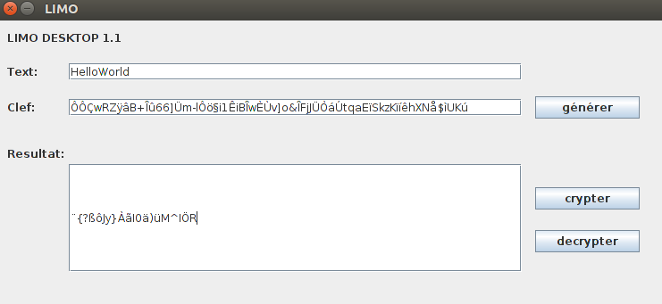

LIMO-desktop
============

LIMO-Desktop est un petit utilitaire permetant de chiffrer ses messages.
LIMO-Desktop utilie la librairie [LIMO](https://github.com/app-solutions/limo).

Il est actuellement possible de chiffrer les messages avec:
 * L'algorithme de Vernam Modifier

Vous pouvez telecharger la derniere version de LIMO-desktop [ICI](https://sourceforge.net/projects/limodesktop/)

